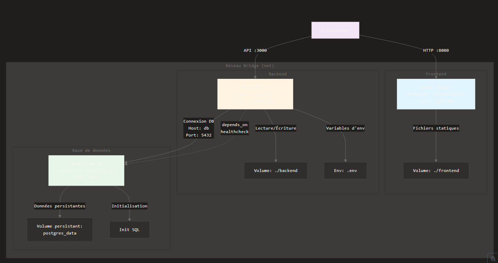

# Prérequis

Avant de commencer, assurez-vous d'avoir installé les éléments suivants sur votre machine :

-   Docker : Version 20.10+ recommandée.
-   Docker Compose : Inclus généralement avec Docker Desktop.
-   OS Compatible : Linux, macOS, ou Windows (via WSL2).

# Procédure de build et de lancement des services

Il faut lancer `docker-compose up --build`

-   Frontend : http://localhost:3000 (ou port spécifié)
-   API : http://localhost:8080
-   Base de données : Accessible via le port interne 5432 (par défaut)

# Description des services, des ports utilisés, des variables d'environnement

L'application repose sur une architecture de micro-services conteneurisés pour assurer une isolation complète et une facilité de déploiement.

-   Frontend : Interface utilisateur (HTML statique).
-   API : Le cœur de la logique métier (Node.js).
-   DB : Base de données pour la persistance des données (PostgreSQL).

# Explication des choix techniques principaux

Le projet suit une architecture "N-Tier" (multi-couches) standard, privilégiant la scalabilité et la séparation des préoccupations (Separation of Concerns).

